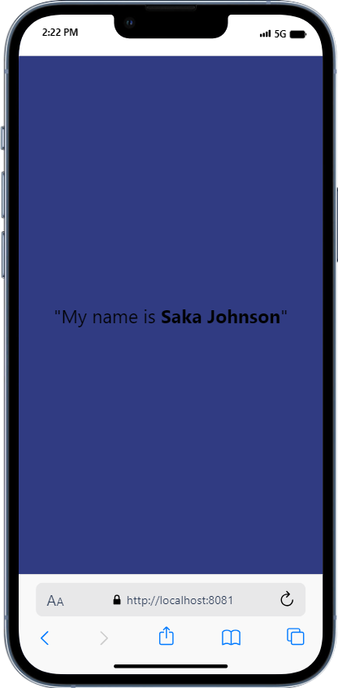

# MyReactApp
# ID 11037486

Welcome to MyReactApp! This project is a React Native application built with Expo, designed to display my name.


## Table of Contents
-[About the Project]
- [Installation]
- [Usage]
-  [Contributing]
-   [License]
- [Contact]

  ## About the Project
  Certainly! Here's a simple overview of your project:

---

## Project Overview

**Project Name:** MyReactApp

**Description:**
MyReactApp is a React Native application built with Expo. It serves as a template for creating mobile applications using React Native and Expo. The project includes basic functionality such as navigation, state management, and API integration, making it a great starting point for developers looking to build cross-platform mobile apps with React Native.

**Key Features:**
- Cross-platform compatibility
- Expo integration for rapid development
- Navigation using React Navigation
- State management with React Context or Redux
- API integration for fetching and displaying data
- Easily customizable and extendable for specific use cases

**Target Audience:**
- Beginner to intermediate React Native developers
- Developers looking to create mobile apps with React Native and Expo
- Individuals interested in learning React Native development best practices

**Purpose:**
The purpose of MyReactApp is to provide a foundation for building mobile applications with React Native and Expo. By offering a simple yet comprehensive project structure, developers can focus on implementing features and functionality specific to their app without having to worry about setting up boilerplate code from scratch.

**Technologies Used:**
- React Native
- Expo
- React Navigation
- Redux (optional)
- RESTful APIs (optional)
- Git version control

---

## Installation

To get started with MyReactApp, follow these steps:

1. Clone the repository:

   ```bash
   git clone https://github.com/your-username/my-react-app.git
  2.Navigate to the project directory:
   ```bash
    cd my-react-app.

3.Install dependencies:
   ```bash

Usage
To run MyReactApp on your local machine, use the following command:

bash
Copy code
npm start
This will start the Expo development server, allowing you to view the app on your device or emulator.


----
Contributing
Contributions are welcome! If you'd like to contribute to MyReactApp, please follow these steps:

Fork the repository
Create your feature branch (git checkout -b feature/YourFeature)
Commit your changes (git commit -m 'Add some feature')
Push to the branch (git push origin feature/YourFeature)
Open a pull request
  
  
